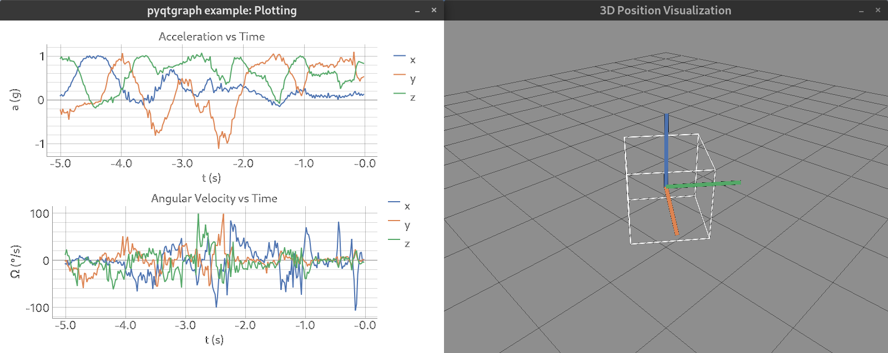

# Rust 3D Orientation Demo

I wrote this application as an introduction to Rust on an embedded device.
The demo reads acceleration and angular velocity from a MEMS sensor over an I2C bus and estimates its current orientation in 3D space, based on the sensor values.
The orientation estimate is printed to UART connected to the virtual COM port of the debugger. On a computer the orientation can be received and visualized using [a python script](https://github.com/stefanluethi/3d-visualization).



## Prequisites

You will need the following hardware:
- STM32F446 eval board, NUCLEO-F446RE
- ST sensor shield, X-NUCLEO-IKS01A3

To build the project you will need:
- Rust and Cargo (follow the [Rust getting started guide](https://www.rust-lang.org/learn/get-started))
- Add ARMv7em back-end
    ```bash
    rustup target add thumbv7em-none-eabihf
    ```
- Switch toolchain to nightly (needed for [const generics](https://rust-lang.github.io/rfcs/2000-const-generics.html))
    ```bash
    rustup default nightly
    ```
- To debug the application you can use openocd and gdb


## Usage

Build the project:
```bash
cargo build
```

Use openocd and gdb to flash and start the application. Be sure to use the configuration provided in the root directory (`openocd.cfg` and `openocd.gdb`).
